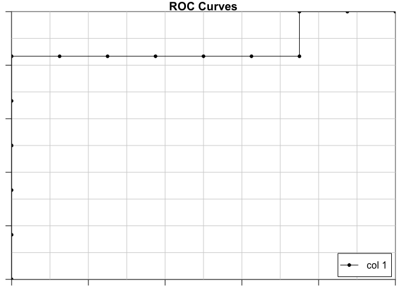
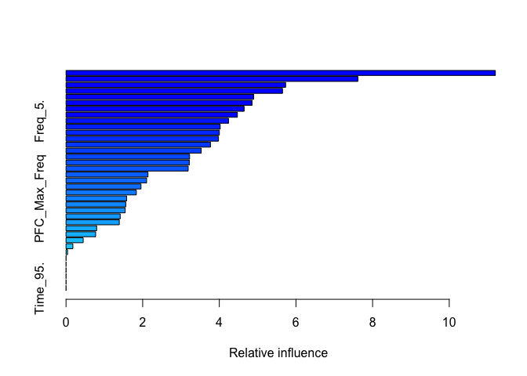
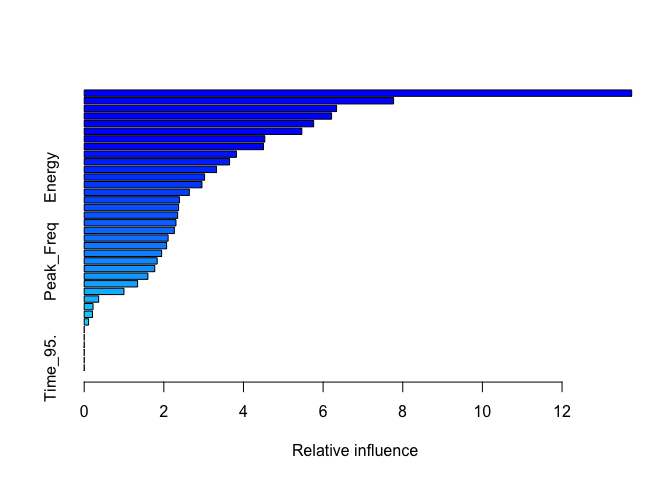
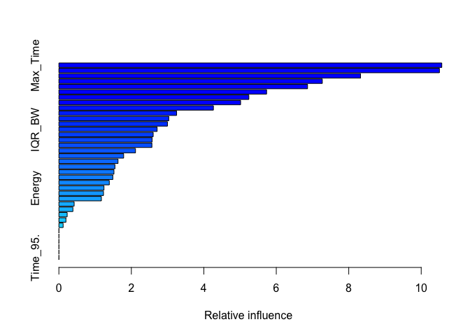

bat\_calls
================
Ilya

\#\#\#\#\#install packages

    ## Loading required package: lattice

    ## Loading required package: ggplot2

    ## 
    ## Attaching package: 'dplyr'

    ## The following objects are masked from 'package:stats':
    ## 
    ##     filter, lag

    ## The following objects are masked from 'package:base':
    ## 
    ##     intersect, setdiff, setequal, union

    ## Loaded gbm 2.1.5

    ## Loading required package: gplots

    ## 
    ## Attaching package: 'gplots'

    ## The following object is masked from 'package:stats':
    ## 
    ##     lowess

\#\#read in data

``` r
C = read.csv("Calls.csv")
C$Species_no = 0
igrey = which(C$Species=="Grey")
C$Species_no[igrey]=1

rm = c("Name", "Species")
keep= setdiff(names(C), rm)
C = C[,keep]

save(C, file = "C.Rdata")
```

``` r
load("C.Rdata")
# get the feature real names
label_col = which(names(C)== "Species_no")

names <-  colnames(C[,-c(label_col)])
y_col = label_col

model<-as.formula(paste(colnames(C)[y_col], "~",
                        paste(names,collapse = "+"),
                        sep = ""))
model
```

    ## Species_no ~ No_of_harmonics + Agg_Entropy + Avg_Entropy + Avg_Power + 
    ##     BW_90. + Center_Freq + Center_Time + Center_Time_Rel + Delta_Freq + 
    ##     Delta_Time + Dur_90. + Energy + Freq_5. + Freq_5.._Rel + 
    ##     Freq_95. + Freq_95._Rel + IQR_BW + IQR_Dur + Inband_Power + 
    ##     Max_Entropy + Max_Freq + Max_Power + Max_Time + Min_Entropy + 
    ##     Peak_Freq + PFC_Max_Freq + PFC_Max_Slope + PFC_Min_Freq + 
    ##     PFC_Num_Inf_Pts + Peak_Power + Peak_Time + Peak_Time_Relative + 
    ##     Sample_Length + Time_5. + Time_5._Rel + Time_95. + Time_95._Rel

``` r
DP =createDataPartition(y = C$Species_no, 
                        p = 0.8,
                        list = FALSE)
Train = C[DP,]
Test = C[-DP,]

ptm<-proc.time()

n.trees = 15000
shrinkage = 0.001#final version should be 0.001
cv.folds = 10#final version should be 10
gbmtest<- gbm(model,
              data=Train,
              distribution="bernoulli",
              n.trees=n.trees,
              shrinkage=shrinkage,
              interaction.depth=3,
              bag.fraction=0.50,
              train.fraction=1,
              n.minobsinnode=5,
              cv.folds=cv.folds,
              keep.data=TRUE,
              verbose=TRUE,
              n.cores=NULL)
```

    ## Iter   TrainDeviance   ValidDeviance   StepSize   Improve
    ##      1        1.3858             nan     0.0010   -0.0002
    ##      2        1.3851             nan     0.0010    0.0001
    ##      3        1.3844             nan     0.0010    0.0001
    ##      4        1.3834             nan     0.0010    0.0003
    ##      5        1.3828             nan     0.0010    0.0000
    ##      6        1.3819             nan     0.0010    0.0002
    ##      7        1.3810             nan     0.0010    0.0002
    ##      8        1.3806             nan     0.0010   -0.0002
    ##      9        1.3800             nan     0.0010   -0.0000
    ##     10        1.3795             nan     0.0010    0.0001
    ##     20        1.3733             nan     0.0010   -0.0001
    ##     40        1.3598             nan     0.0010   -0.0000
    ##     60        1.3467             nan     0.0010    0.0001
    ##     80        1.3336             nan     0.0010    0.0002
    ##    100        1.3201             nan     0.0010   -0.0001
    ##    120        1.3068             nan     0.0010    0.0000
    ##    140        1.2947             nan     0.0010   -0.0001
    ##    160        1.2826             nan     0.0010    0.0003
    ##    180        1.2698             nan     0.0010    0.0000
    ##    200        1.2577             nan     0.0010   -0.0001
    ##    220        1.2436             nan     0.0010    0.0001
    ##    240        1.2323             nan     0.0010    0.0000
    ##    260        1.2203             nan     0.0010    0.0000
    ##    280        1.2083             nan     0.0010    0.0001
    ##    300        1.1971             nan     0.0010   -0.0001
    ##    320        1.1856             nan     0.0010    0.0001
    ##    340        1.1732             nan     0.0010    0.0001
    ##    360        1.1624             nan     0.0010    0.0001
    ##    380        1.1522             nan     0.0010   -0.0001
    ##    400        1.1414             nan     0.0010    0.0001
    ##    420        1.1315             nan     0.0010    0.0000
    ##    440        1.1220             nan     0.0010   -0.0001
    ##    460        1.1126             nan     0.0010   -0.0001
    ##    480        1.1030             nan     0.0010   -0.0001
    ##    500        1.0923             nan     0.0010    0.0001
    ##    520        1.0821             nan     0.0010    0.0000
    ##    540        1.0731             nan     0.0010   -0.0001
    ##    560        1.0633             nan     0.0010   -0.0000
    ##    580        1.0542             nan     0.0010    0.0000
    ##    600        1.0459             nan     0.0010   -0.0001
    ##    620        1.0369             nan     0.0010   -0.0001
    ##    640        1.0285             nan     0.0010   -0.0000
    ##    660        1.0206             nan     0.0010   -0.0000
    ##    680        1.0116             nan     0.0010   -0.0000
    ##    700        1.0033             nan     0.0010   -0.0002
    ##    720        0.9954             nan     0.0010   -0.0000
    ##    740        0.9873             nan     0.0010   -0.0001
    ##    760        0.9798             nan     0.0010   -0.0000
    ##    780        0.9718             nan     0.0010    0.0001
    ##    800        0.9636             nan     0.0010   -0.0001
    ##    820        0.9557             nan     0.0010   -0.0000
    ##    840        0.9480             nan     0.0010   -0.0001
    ##    860        0.9402             nan     0.0010    0.0001
    ##    880        0.9323             nan     0.0010   -0.0000
    ##    900        0.9250             nan     0.0010   -0.0001
    ##    920        0.9173             nan     0.0010    0.0001
    ##    940        0.9102             nan     0.0010   -0.0000
    ##    960        0.9033             nan     0.0010    0.0001
    ##    980        0.8963             nan     0.0010   -0.0000
    ##   1000        0.8894             nan     0.0010   -0.0002
    ##   1020        0.8828             nan     0.0010    0.0000
    ##   1040        0.8755             nan     0.0010    0.0000
    ##   1060        0.8690             nan     0.0010    0.0001
    ##   1080        0.8629             nan     0.0010   -0.0000
    ##   1100        0.8560             nan     0.0010    0.0001
    ##   1120        0.8499             nan     0.0010    0.0001
    ##   1140        0.8430             nan     0.0010   -0.0001
    ##   1160        0.8362             nan     0.0010   -0.0003
    ##   1180        0.8296             nan     0.0010   -0.0001
    ##   1200        0.8227             nan     0.0010   -0.0000
    ##   1220        0.8168             nan     0.0010   -0.0001
    ##   1240        0.8102             nan     0.0010   -0.0000
    ##   1260        0.8041             nan     0.0010   -0.0001
    ##   1280        0.7978             nan     0.0010    0.0000
    ##   1300        0.7913             nan     0.0010    0.0001
    ##   1320        0.7855             nan     0.0010   -0.0000
    ##   1340        0.7801             nan     0.0010    0.0001
    ##   1360        0.7751             nan     0.0010   -0.0000
    ##   1380        0.7697             nan     0.0010    0.0000
    ##   1400        0.7641             nan     0.0010    0.0000
    ##   1420        0.7585             nan     0.0010   -0.0000
    ##   1440        0.7527             nan     0.0010    0.0000
    ##   1460        0.7473             nan     0.0010   -0.0000
    ##   1480        0.7417             nan     0.0010    0.0000
    ##   1500        0.7356             nan     0.0010    0.0001
    ##   1520        0.7305             nan     0.0010   -0.0000
    ##   1540        0.7256             nan     0.0010   -0.0000
    ##   1560        0.7210             nan     0.0010   -0.0000
    ##   1580        0.7154             nan     0.0010   -0.0000
    ##   1600        0.7102             nan     0.0010    0.0000
    ##   1620        0.7048             nan     0.0010    0.0000
    ##   1640        0.7002             nan     0.0010   -0.0000
    ##   1660        0.6949             nan     0.0010   -0.0000
    ##   1680        0.6899             nan     0.0010   -0.0001
    ##   1700        0.6853             nan     0.0010   -0.0000
    ##   1720        0.6810             nan     0.0010   -0.0001
    ##   1740        0.6764             nan     0.0010   -0.0001
    ##   1760        0.6715             nan     0.0010   -0.0001
    ##   1780        0.6665             nan     0.0010   -0.0001
    ##   1800        0.6619             nan     0.0010   -0.0000
    ##   1820        0.6574             nan     0.0010    0.0000
    ##   1840        0.6533             nan     0.0010   -0.0000
    ##   1860        0.6487             nan     0.0010    0.0000
    ##   1880        0.6437             nan     0.0010   -0.0000
    ##   1900        0.6401             nan     0.0010    0.0000
    ##   1920        0.6351             nan     0.0010   -0.0001
    ##   1940        0.6310             nan     0.0010    0.0000
    ##   1960        0.6273             nan     0.0010   -0.0001
    ##   1980        0.6233             nan     0.0010   -0.0001
    ##   2000        0.6190             nan     0.0010   -0.0000
    ##   2020        0.6149             nan     0.0010   -0.0000
    ##   2040        0.6105             nan     0.0010   -0.0000
    ##   2060        0.6066             nan     0.0010    0.0000
    ##   2080        0.6024             nan     0.0010   -0.0000
    ##   2100        0.5986             nan     0.0010   -0.0000
    ##   2120        0.5944             nan     0.0010   -0.0001
    ##   2140        0.5900             nan     0.0010   -0.0001
    ##   2160        0.5858             nan     0.0010    0.0001
    ##   2180        0.5820             nan     0.0010   -0.0000
    ##   2200        0.5780             nan     0.0010   -0.0000
    ##   2220        0.5738             nan     0.0010   -0.0001
    ##   2240        0.5706             nan     0.0010   -0.0002
    ##   2260        0.5666             nan     0.0010    0.0000
    ##   2280        0.5628             nan     0.0010   -0.0000
    ##   2300        0.5587             nan     0.0010    0.0000
    ##   2320        0.5552             nan     0.0010   -0.0000
    ##   2340        0.5517             nan     0.0010   -0.0001
    ##   2360        0.5478             nan     0.0010   -0.0001
    ##   2380        0.5442             nan     0.0010   -0.0001
    ##   2400        0.5407             nan     0.0010   -0.0000
    ##   2420        0.5373             nan     0.0010   -0.0000
    ##   2440        0.5338             nan     0.0010   -0.0000
    ##   2460        0.5305             nan     0.0010   -0.0000
    ##   2480        0.5271             nan     0.0010   -0.0000
    ##   2500        0.5237             nan     0.0010    0.0000
    ##   2520        0.5207             nan     0.0010   -0.0000
    ##   2540        0.5171             nan     0.0010   -0.0000
    ##   2560        0.5137             nan     0.0010   -0.0000
    ##   2580        0.5103             nan     0.0010   -0.0000
    ##   2600        0.5072             nan     0.0010   -0.0000
    ##   2620        0.5036             nan     0.0010   -0.0001
    ##   2640        0.5005             nan     0.0010   -0.0000
    ##   2660        0.4974             nan     0.0010   -0.0001
    ##   2680        0.4944             nan     0.0010   -0.0000
    ##   2700        0.4912             nan     0.0010   -0.0001
    ##   2720        0.4881             nan     0.0010   -0.0001
    ##   2740        0.4850             nan     0.0010   -0.0001
    ##   2760        0.4820             nan     0.0010   -0.0000
    ##   2780        0.4788             nan     0.0010    0.0000
    ##   2800        0.4758             nan     0.0010   -0.0000
    ##   2820        0.4726             nan     0.0010   -0.0000
    ##   2840        0.4696             nan     0.0010   -0.0001
    ##   2860        0.4667             nan     0.0010   -0.0000
    ##   2880        0.4636             nan     0.0010    0.0000
    ##   2900        0.4608             nan     0.0010   -0.0000
    ##   2920        0.4579             nan     0.0010   -0.0001
    ##   2940        0.4547             nan     0.0010   -0.0000
    ##   2960        0.4518             nan     0.0010   -0.0000
    ##   2980        0.4493             nan     0.0010    0.0000
    ##   3000        0.4463             nan     0.0010   -0.0001
    ##   3020        0.4435             nan     0.0010   -0.0001
    ##   3040        0.4404             nan     0.0010   -0.0000
    ##   3060        0.4375             nan     0.0010   -0.0001
    ##   3080        0.4347             nan     0.0010   -0.0000
    ##   3100        0.4325             nan     0.0010   -0.0000
    ##   3120        0.4299             nan     0.0010   -0.0000
    ##   3140        0.4272             nan     0.0010   -0.0001
    ##   3160        0.4245             nan     0.0010   -0.0000
    ##   3180        0.4220             nan     0.0010   -0.0000
    ##   3200        0.4191             nan     0.0010   -0.0000
    ##   3220        0.4166             nan     0.0010   -0.0000
    ##   3240        0.4142             nan     0.0010   -0.0001
    ##   3260        0.4113             nan     0.0010   -0.0000
    ##   3280        0.4090             nan     0.0010   -0.0001
    ##   3300        0.4062             nan     0.0010   -0.0000
    ##   3320        0.4041             nan     0.0010   -0.0000
    ##   3340        0.4016             nan     0.0010   -0.0000
    ##   3360        0.3991             nan     0.0010   -0.0001
    ##   3380        0.3966             nan     0.0010    0.0000
    ##   3400        0.3940             nan     0.0010   -0.0000
    ##   3420        0.3914             nan     0.0010   -0.0001
    ##   3440        0.3888             nan     0.0010    0.0000
    ##   3460        0.3865             nan     0.0010    0.0000
    ##   3480        0.3843             nan     0.0010   -0.0000
    ##   3500        0.3823             nan     0.0010   -0.0001
    ##   3520        0.3798             nan     0.0010   -0.0000
    ##   3540        0.3774             nan     0.0010   -0.0000
    ##   3560        0.3750             nan     0.0010    0.0000
    ##   3580        0.3728             nan     0.0010   -0.0000
    ##   3600        0.3704             nan     0.0010   -0.0001
    ##   3620        0.3682             nan     0.0010   -0.0001
    ##   3640        0.3662             nan     0.0010   -0.0000
    ##   3660        0.3642             nan     0.0010   -0.0000
    ##   3680        0.3621             nan     0.0010   -0.0000
    ##   3700        0.3597             nan     0.0010   -0.0000
    ##   3720        0.3576             nan     0.0010   -0.0001
    ##   3740        0.3554             nan     0.0010   -0.0000
    ##   3760        0.3534             nan     0.0010   -0.0001
    ##   3780        0.3513             nan     0.0010    0.0000
    ##   3800        0.3492             nan     0.0010   -0.0000
    ##   3820        0.3474             nan     0.0010   -0.0001
    ##   3840        0.3453             nan     0.0010   -0.0000
    ##   3860        0.3431             nan     0.0010   -0.0000
    ##   3880        0.3412             nan     0.0010   -0.0000
    ##   3900        0.3392             nan     0.0010   -0.0000
    ##   3920        0.3370             nan     0.0010   -0.0000
    ##   3940        0.3350             nan     0.0010   -0.0000
    ##   3960        0.3332             nan     0.0010    0.0000
    ##   3980        0.3310             nan     0.0010   -0.0000
    ##   4000        0.3290             nan     0.0010   -0.0000
    ##   4020        0.3271             nan     0.0010   -0.0000
    ##   4040        0.3254             nan     0.0010   -0.0000
    ##   4060        0.3234             nan     0.0010   -0.0000
    ##   4080        0.3216             nan     0.0010   -0.0000
    ##   4100        0.3195             nan     0.0010   -0.0000
    ##   4120        0.3177             nan     0.0010   -0.0000
    ##   4140        0.3160             nan     0.0010   -0.0000
    ##   4160        0.3142             nan     0.0010   -0.0000
    ##   4180        0.3122             nan     0.0010   -0.0000
    ##   4200        0.3106             nan     0.0010   -0.0001
    ##   4220        0.3089             nan     0.0010   -0.0001
    ##   4240        0.3072             nan     0.0010   -0.0001
    ##   4260        0.3052             nan     0.0010   -0.0000
    ##   4280        0.3034             nan     0.0010   -0.0000
    ##   4300        0.3018             nan     0.0010   -0.0000
    ##   4320        0.3001             nan     0.0010   -0.0000
    ##   4340        0.2982             nan     0.0010    0.0000
    ##   4360        0.2967             nan     0.0010   -0.0000
    ##   4380        0.2949             nan     0.0010   -0.0000
    ##   4400        0.2933             nan     0.0010   -0.0001
    ##   4420        0.2918             nan     0.0010   -0.0000
    ##   4440        0.2900             nan     0.0010   -0.0000
    ##   4460        0.2884             nan     0.0010   -0.0000
    ##   4480        0.2868             nan     0.0010   -0.0000
    ##   4500        0.2852             nan     0.0010    0.0000
    ##   4520        0.2836             nan     0.0010   -0.0000
    ##   4540        0.2819             nan     0.0010   -0.0000
    ##   4560        0.2803             nan     0.0010   -0.0000
    ##   4580        0.2787             nan     0.0010   -0.0000
    ##   4600        0.2770             nan     0.0010   -0.0000
    ##   4620        0.2754             nan     0.0010   -0.0000
    ##   4640        0.2737             nan     0.0010   -0.0000
    ##   4660        0.2721             nan     0.0010   -0.0000
    ##   4680        0.2705             nan     0.0010   -0.0000
    ##   4700        0.2691             nan     0.0010   -0.0000
    ##   4720        0.2676             nan     0.0010   -0.0000
    ##   4740        0.2657             nan     0.0010    0.0000
    ##   4760        0.2642             nan     0.0010   -0.0000
    ##   4780        0.2628             nan     0.0010   -0.0000
    ##   4800        0.2613             nan     0.0010   -0.0000
    ##   4820        0.2598             nan     0.0010   -0.0000
    ##   4840        0.2582             nan     0.0010   -0.0000
    ##   4860        0.2568             nan     0.0010   -0.0000
    ##   4880        0.2553             nan     0.0010   -0.0000
    ##   4900        0.2538             nan     0.0010   -0.0000
    ##   4920        0.2524             nan     0.0010   -0.0000
    ##   4940        0.2509             nan     0.0010   -0.0000
    ##   4960        0.2494             nan     0.0010   -0.0000
    ##   4980        0.2476             nan     0.0010   -0.0000
    ##   5000        0.2461             nan     0.0010   -0.0000
    ##   5020        0.2447             nan     0.0010    0.0000
    ##   5040        0.2432             nan     0.0010   -0.0000
    ##   5060        0.2418             nan     0.0010   -0.0000
    ##   5080        0.2404             nan     0.0010   -0.0000
    ##   5100        0.2389             nan     0.0010   -0.0000
    ##   5120        0.2376             nan     0.0010   -0.0000
    ##   5140        0.2360             nan     0.0010   -0.0000
    ##   5160        0.2349             nan     0.0010   -0.0000
    ##   5180        0.2335             nan     0.0010   -0.0000
    ##   5200        0.2321             nan     0.0010   -0.0000
    ##   5220        0.2308             nan     0.0010    0.0000
    ##   5240        0.2294             nan     0.0010   -0.0000
    ##   5260        0.2282             nan     0.0010   -0.0000
    ##   5280        0.2270             nan     0.0010   -0.0001
    ##   5300        0.2257             nan     0.0010    0.0000
    ##   5320        0.2244             nan     0.0010    0.0000
    ##   5340        0.2231             nan     0.0010   -0.0000
    ##   5360        0.2218             nan     0.0010   -0.0000
    ##   5380        0.2206             nan     0.0010   -0.0000
    ##   5400        0.2193             nan     0.0010   -0.0000
    ##   5420        0.2182             nan     0.0010   -0.0000
    ##   5440        0.2171             nan     0.0010    0.0000
    ##   5460        0.2159             nan     0.0010    0.0000
    ##   5480        0.2147             nan     0.0010   -0.0000
    ##   5500        0.2136             nan     0.0010   -0.0001
    ##   5520        0.2125             nan     0.0010   -0.0000
    ##   5540        0.2116             nan     0.0010   -0.0000
    ##   5560        0.2105             nan     0.0010    0.0000
    ##   5580        0.2094             nan     0.0010    0.0000
    ##   5600        0.2082             nan     0.0010   -0.0000
    ##   5620        0.2070             nan     0.0010   -0.0000
    ##   5640        0.2059             nan     0.0010   -0.0000
    ##   5660        0.2048             nan     0.0010    0.0000
    ##   5680        0.2038             nan     0.0010   -0.0000
    ##   5700        0.2027             nan     0.0010   -0.0000
    ##   5720        0.2015             nan     0.0010   -0.0000
    ##   5740        0.2005             nan     0.0010   -0.0000
    ##   5760        0.1994             nan     0.0010   -0.0000
    ##   5780        0.1983             nan     0.0010    0.0000
    ##   5800        0.1971             nan     0.0010   -0.0001
    ##   5820        0.1960             nan     0.0010    0.0000
    ##   5840        0.1950             nan     0.0010   -0.0000
    ##   5860        0.1939             nan     0.0010   -0.0000
    ##   5880        0.1928             nan     0.0010    0.0000
    ##   5900        0.1917             nan     0.0010   -0.0000
    ##   5920        0.1905             nan     0.0010   -0.0000
    ##   5940        0.1894             nan     0.0010   -0.0000
    ##   5960        0.1884             nan     0.0010   -0.0000
    ##   5980        0.1876             nan     0.0010   -0.0000
    ##   6000        0.1866             nan     0.0010    0.0000
    ##   6020        0.1856             nan     0.0010   -0.0000
    ##   6040        0.1846             nan     0.0010   -0.0000
    ##   6060        0.1835             nan     0.0010   -0.0000
    ##   6080        0.1825             nan     0.0010   -0.0000
    ##   6100        0.1814             nan     0.0010    0.0000
    ##   6120        0.1804             nan     0.0010   -0.0000
    ##   6140        0.1793             nan     0.0010   -0.0000
    ##   6160        0.1782             nan     0.0010   -0.0000
    ##   6180        0.1771             nan     0.0010   -0.0000
    ##   6200        0.1762             nan     0.0010   -0.0000
    ##   6220        0.1752             nan     0.0010    0.0000
    ##   6240        0.1742             nan     0.0010   -0.0000
    ##   6260        0.1732             nan     0.0010   -0.0000
    ##   6280        0.1723             nan     0.0010   -0.0000
    ##   6300        0.1715             nan     0.0010   -0.0000
    ##   6320        0.1706             nan     0.0010   -0.0000
    ##   6340        0.1699             nan     0.0010   -0.0000
    ##   6360        0.1690             nan     0.0010   -0.0000
    ##   6380        0.1680             nan     0.0010   -0.0000
    ##   6400        0.1672             nan     0.0010   -0.0000
    ##   6420        0.1663             nan     0.0010   -0.0000
    ##   6440        0.1655             nan     0.0010   -0.0000
    ##   6460        0.1645             nan     0.0010   -0.0000
    ##   6480        0.1637             nan     0.0010   -0.0000
    ##   6500        0.1628             nan     0.0010   -0.0000
    ##   6520        0.1619             nan     0.0010   -0.0000
    ##   6540        0.1610             nan     0.0010   -0.0000
    ##   6560        0.1601             nan     0.0010   -0.0000
    ##   6580        0.1592             nan     0.0010   -0.0000
    ##   6600        0.1584             nan     0.0010   -0.0000
    ##   6620        0.1576             nan     0.0010   -0.0000
    ##   6640        0.1569             nan     0.0010   -0.0000
    ##   6660        0.1561             nan     0.0010   -0.0000
    ##   6680        0.1552             nan     0.0010   -0.0000
    ##   6700        0.1543             nan     0.0010   -0.0000
    ##   6720        0.1535             nan     0.0010    0.0000
    ##   6740        0.1527             nan     0.0010   -0.0000
    ##   6760        0.1519             nan     0.0010   -0.0000
    ##   6780        0.1511             nan     0.0010    0.0000
    ##   6800        0.1503             nan     0.0010   -0.0000
    ##   6820        0.1495             nan     0.0010   -0.0000
    ##   6840        0.1488             nan     0.0010   -0.0000
    ##   6860        0.1480             nan     0.0010    0.0000
    ##   6880        0.1472             nan     0.0010   -0.0000
    ##   6900        0.1465             nan     0.0010   -0.0000
    ##   6920        0.1456             nan     0.0010   -0.0000
    ##   6940        0.1449             nan     0.0010   -0.0000
    ##   6960        0.1441             nan     0.0010   -0.0000
    ##   6980        0.1432             nan     0.0010   -0.0000
    ##   7000        0.1424             nan     0.0010   -0.0000
    ##   7020        0.1417             nan     0.0010   -0.0000
    ##   7040        0.1409             nan     0.0010   -0.0000
    ##   7060        0.1402             nan     0.0010   -0.0000
    ##   7080        0.1394             nan     0.0010   -0.0000
    ##   7100        0.1386             nan     0.0010   -0.0000
    ##   7120        0.1379             nan     0.0010   -0.0000
    ##   7140        0.1371             nan     0.0010   -0.0000
    ##   7160        0.1364             nan     0.0010   -0.0000
    ##   7180        0.1357             nan     0.0010   -0.0000
    ##   7200        0.1350             nan     0.0010   -0.0000
    ##   7220        0.1342             nan     0.0010   -0.0000
    ##   7240        0.1335             nan     0.0010   -0.0000
    ##   7260        0.1326             nan     0.0010    0.0000
    ##   7280        0.1319             nan     0.0010   -0.0000
    ##   7300        0.1313             nan     0.0010   -0.0000
    ##   7320        0.1306             nan     0.0010    0.0000
    ##   7340        0.1297             nan     0.0010   -0.0000
    ##   7360        0.1290             nan     0.0010   -0.0000
    ##   7380        0.1284             nan     0.0010   -0.0000
    ##   7400        0.1278             nan     0.0010   -0.0000
    ##   7420        0.1271             nan     0.0010   -0.0000
    ##   7440        0.1264             nan     0.0010   -0.0000
    ##   7460        0.1258             nan     0.0010   -0.0000
    ##   7480        0.1252             nan     0.0010   -0.0000
    ##   7500        0.1244             nan     0.0010   -0.0000
    ##   7520        0.1237             nan     0.0010   -0.0000
    ##   7540        0.1230             nan     0.0010   -0.0000
    ##   7560        0.1224             nan     0.0010   -0.0000
    ##   7580        0.1218             nan     0.0010   -0.0000
    ##   7600        0.1211             nan     0.0010   -0.0000
    ##   7620        0.1205             nan     0.0010   -0.0000
    ##   7640        0.1198             nan     0.0010   -0.0000
    ##   7660        0.1192             nan     0.0010   -0.0000
    ##   7680        0.1186             nan     0.0010   -0.0000
    ##   7700        0.1180             nan     0.0010   -0.0000
    ##   7720        0.1174             nan     0.0010   -0.0000
    ##   7740        0.1168             nan     0.0010   -0.0000
    ##   7760        0.1162             nan     0.0010   -0.0000
    ##   7780        0.1154             nan     0.0010   -0.0000
    ##   7800        0.1148             nan     0.0010   -0.0000
    ##   7820        0.1142             nan     0.0010   -0.0000
    ##   7840        0.1136             nan     0.0010   -0.0000
    ##   7860        0.1130             nan     0.0010   -0.0000
    ##   7880        0.1124             nan     0.0010   -0.0000
    ##   7900        0.1119             nan     0.0010   -0.0000
    ##   7920        0.1113             nan     0.0010   -0.0000
    ##   7940        0.1107             nan     0.0010   -0.0000
    ##   7960        0.1101             nan     0.0010   -0.0000
    ##   7980        0.1097             nan     0.0010    0.0000
    ##   8000        0.1091             nan     0.0010   -0.0000
    ##   8020        0.1086             nan     0.0010   -0.0000
    ##   8040        0.1080             nan     0.0010   -0.0000
    ##   8060        0.1075             nan     0.0010   -0.0000
    ##   8080        0.1070             nan     0.0010   -0.0000
    ##   8100        0.1064             nan     0.0010   -0.0000
    ##   8120        0.1059             nan     0.0010   -0.0000
    ##   8140        0.1054             nan     0.0010   -0.0000
    ##   8160        0.1049             nan     0.0010   -0.0000
    ##   8180        0.1044             nan     0.0010   -0.0000
    ##   8200        0.1038             nan     0.0010    0.0000
    ##   8220        0.1033             nan     0.0010   -0.0000
    ##   8240        0.1028             nan     0.0010   -0.0000
    ##   8260        0.1023             nan     0.0010   -0.0000
    ##   8280        0.1018             nan     0.0010   -0.0000
    ##   8300        0.1013             nan     0.0010   -0.0000
    ##   8320        0.1008             nan     0.0010   -0.0000
    ##   8340        0.1003             nan     0.0010   -0.0000
    ##   8360        0.0998             nan     0.0010   -0.0000
    ##   8380        0.0992             nan     0.0010    0.0000
    ##   8400        0.0988             nan     0.0010   -0.0000
    ##   8420        0.0982             nan     0.0010   -0.0000
    ##   8440        0.0978             nan     0.0010   -0.0000
    ##   8460        0.0973             nan     0.0010   -0.0000
    ##   8480        0.0968             nan     0.0010    0.0000
    ##   8500        0.0963             nan     0.0010    0.0000
    ##   8520        0.0957             nan     0.0010   -0.0000
    ##   8540        0.0953             nan     0.0010   -0.0000
    ##   8560        0.0948             nan     0.0010   -0.0000
    ##   8580        0.0943             nan     0.0010   -0.0000
    ##   8600        0.0939             nan     0.0010   -0.0000
    ##   8620        0.0934             nan     0.0010   -0.0000
    ##   8640        0.0929             nan     0.0010   -0.0000
    ##   8660        0.0924             nan     0.0010   -0.0000
    ##   8680        0.0919             nan     0.0010   -0.0000
    ##   8700        0.0915             nan     0.0010   -0.0000
    ##   8720        0.0909             nan     0.0010   -0.0000
    ##   8740        0.0904             nan     0.0010   -0.0000
    ##   8760        0.0900             nan     0.0010   -0.0000
    ##   8780        0.0895             nan     0.0010   -0.0000
    ##   8800        0.0891             nan     0.0010   -0.0000
    ##   8820        0.0887             nan     0.0010   -0.0000
    ##   8840        0.0882             nan     0.0010    0.0000
    ##   8860        0.0878             nan     0.0010   -0.0000
    ##   8880        0.0874             nan     0.0010   -0.0000
    ##   8900        0.0869             nan     0.0010   -0.0000
    ##   8920        0.0865             nan     0.0010   -0.0000
    ##   8940        0.0860             nan     0.0010   -0.0000
    ##   8960        0.0856             nan     0.0010   -0.0000
    ##   8980        0.0851             nan     0.0010   -0.0000
    ##   9000        0.0848             nan     0.0010   -0.0000
    ##   9020        0.0844             nan     0.0010   -0.0000
    ##   9040        0.0840             nan     0.0010   -0.0000
    ##   9060        0.0835             nan     0.0010   -0.0000
    ##   9080        0.0830             nan     0.0010    0.0000
    ##   9100        0.0826             nan     0.0010   -0.0000
    ##   9120        0.0822             nan     0.0010   -0.0000
    ##   9140        0.0818             nan     0.0010   -0.0000
    ##   9160        0.0814             nan     0.0010   -0.0000
    ##   9180        0.0810             nan     0.0010   -0.0000
    ##   9200        0.0806             nan     0.0010   -0.0000
    ##   9220        0.0802             nan     0.0010   -0.0000
    ##   9240        0.0798             nan     0.0010    0.0000
    ##   9260        0.0793             nan     0.0010   -0.0000
    ##   9280        0.0789             nan     0.0010   -0.0000
    ##   9300        0.0785             nan     0.0010   -0.0000
    ##   9320        0.0781             nan     0.0010   -0.0000
    ##   9340        0.0777             nan     0.0010   -0.0000
    ##   9360        0.0773             nan     0.0010   -0.0000
    ##   9380        0.0769             nan     0.0010   -0.0000
    ##   9400        0.0766             nan     0.0010   -0.0000
    ##   9420        0.0762             nan     0.0010   -0.0000
    ##   9440        0.0760             nan     0.0010   -0.0000
    ##   9460        0.0756             nan     0.0010   -0.0000
    ##   9480        0.0752             nan     0.0010   -0.0000
    ##   9500        0.0749             nan     0.0010   -0.0000
    ##   9520        0.0746             nan     0.0010    0.0000
    ##   9540        0.0743             nan     0.0010   -0.0000
    ##   9560        0.0739             nan     0.0010   -0.0000
    ##   9580        0.0736             nan     0.0010   -0.0000
    ##   9600        0.0732             nan     0.0010   -0.0000
    ##   9620        0.0729             nan     0.0010   -0.0000
    ##   9640        0.0726             nan     0.0010    0.0000
    ##   9660        0.0721             nan     0.0010   -0.0000
    ##   9680        0.0717             nan     0.0010   -0.0000
    ##   9700        0.0714             nan     0.0010   -0.0000
    ##   9720        0.0711             nan     0.0010   -0.0000
    ##   9740        0.0707             nan     0.0010    0.0000
    ##   9760        0.0704             nan     0.0010   -0.0000
    ##   9780        0.0700             nan     0.0010   -0.0000
    ##   9800        0.0696             nan     0.0010   -0.0000
    ##   9820        0.0693             nan     0.0010   -0.0000
    ##   9840        0.0690             nan     0.0010   -0.0000
    ##   9860        0.0687             nan     0.0010   -0.0000
    ##   9880        0.0683             nan     0.0010   -0.0000
    ##   9900        0.0680             nan     0.0010   -0.0000
    ##   9920        0.0676             nan     0.0010   -0.0000
    ##   9940        0.0673             nan     0.0010    0.0000
    ##   9960        0.0670             nan     0.0010   -0.0000
    ##   9980        0.0667             nan     0.0010   -0.0000
    ##  10000        0.0664             nan     0.0010   -0.0000
    ##  10020        0.0660             nan     0.0010   -0.0000
    ##  10040        0.0656             nan     0.0010   -0.0000
    ##  10060        0.0653             nan     0.0010   -0.0000
    ##  10080        0.0650             nan     0.0010   -0.0000
    ##  10100        0.0646             nan     0.0010   -0.0000
    ##  10120        0.0643             nan     0.0010   -0.0000
    ##  10140        0.0641             nan     0.0010   -0.0000
    ##  10160        0.0638             nan     0.0010   -0.0000
    ##  10180        0.0635             nan     0.0010   -0.0000
    ##  10200        0.0631             nan     0.0010   -0.0000
    ##  10220        0.0628             nan     0.0010    0.0000
    ##  10240        0.0625             nan     0.0010   -0.0000
    ##  10260        0.0622             nan     0.0010   -0.0000
    ##  10280        0.0619             nan     0.0010   -0.0000
    ##  10300        0.0616             nan     0.0010   -0.0000
    ##  10320        0.0613             nan     0.0010   -0.0000
    ##  10340        0.0610             nan     0.0010   -0.0000
    ##  10360        0.0607             nan     0.0010   -0.0000
    ##  10380        0.0604             nan     0.0010   -0.0000
    ##  10400        0.0601             nan     0.0010   -0.0000
    ##  10420        0.0598             nan     0.0010   -0.0000
    ##  10440        0.0595             nan     0.0010   -0.0000
    ##  10460        0.0593             nan     0.0010   -0.0000
    ##  10480        0.0590             nan     0.0010   -0.0000
    ##  10500        0.0587             nan     0.0010   -0.0000
    ##  10520        0.0584             nan     0.0010    0.0000
    ##  10540        0.0581             nan     0.0010   -0.0000
    ##  10560        0.0578             nan     0.0010   -0.0000
    ##  10580        0.0575             nan     0.0010   -0.0000
    ##  10600        0.0572             nan     0.0010   -0.0000
    ##  10620        0.0570             nan     0.0010   -0.0000
    ##  10640        0.0567             nan     0.0010   -0.0000
    ##  10660        0.0564             nan     0.0010   -0.0000
    ##  10680        0.0561             nan     0.0010   -0.0000
    ##  10700        0.0559             nan     0.0010   -0.0000
    ##  10720        0.0556             nan     0.0010   -0.0000
    ##  10740        0.0553             nan     0.0010   -0.0000
    ##  10760        0.0551             nan     0.0010   -0.0000
    ##  10780        0.0548             nan     0.0010   -0.0000
    ##  10800        0.0545             nan     0.0010   -0.0000
    ##  10820        0.0543             nan     0.0010   -0.0000
    ##  10840        0.0540             nan     0.0010   -0.0000
    ##  10860        0.0538             nan     0.0010   -0.0000
    ##  10880        0.0535             nan     0.0010   -0.0000
    ##  10900        0.0532             nan     0.0010    0.0000
    ##  10920        0.0530             nan     0.0010   -0.0000
    ##  10940        0.0527             nan     0.0010   -0.0000
    ##  10960        0.0525             nan     0.0010   -0.0000
    ##  10980        0.0523             nan     0.0010   -0.0000
    ##  11000        0.0520             nan     0.0010   -0.0000
    ##  11020        0.0518             nan     0.0010   -0.0000
    ##  11040        0.0515             nan     0.0010    0.0000
    ##  11060        0.0513             nan     0.0010   -0.0000
    ##  11080        0.0510             nan     0.0010   -0.0000
    ##  11100        0.0508             nan     0.0010   -0.0000
    ##  11120        0.0505             nan     0.0010   -0.0000
    ##  11140        0.0503             nan     0.0010    0.0000
    ##  11160        0.0500             nan     0.0010   -0.0000
    ##  11180        0.0497             nan     0.0010    0.0000
    ##  11200        0.0495             nan     0.0010   -0.0000
    ##  11220        0.0493             nan     0.0010   -0.0000
    ##  11240        0.0490             nan     0.0010   -0.0000
    ##  11260        0.0488             nan     0.0010   -0.0000
    ##  11280        0.0486             nan     0.0010   -0.0000
    ##  11300        0.0483             nan     0.0010   -0.0000
    ##  11320        0.0481             nan     0.0010   -0.0000
    ##  11340        0.0479             nan     0.0010   -0.0000
    ##  11360        0.0477             nan     0.0010   -0.0000
    ##  11380        0.0474             nan     0.0010   -0.0000
    ##  11400        0.0472             nan     0.0010   -0.0000
    ##  11420        0.0470             nan     0.0010   -0.0000
    ##  11440        0.0467             nan     0.0010   -0.0000
    ##  11460        0.0465             nan     0.0010   -0.0000
    ##  11480        0.0463             nan     0.0010   -0.0000
    ##  11500        0.0461             nan     0.0010   -0.0000
    ##  11520        0.0459             nan     0.0010   -0.0000
    ##  11540        0.0456             nan     0.0010   -0.0000
    ##  11560        0.0454             nan     0.0010   -0.0000
    ##  11580        0.0452             nan     0.0010   -0.0000
    ##  11600        0.0450             nan     0.0010    0.0000
    ##  11620        0.0448             nan     0.0010   -0.0000
    ##  11640        0.0445             nan     0.0010   -0.0000
    ##  11660        0.0443             nan     0.0010   -0.0000
    ##  11680        0.0441             nan     0.0010   -0.0000
    ##  11700        0.0439             nan     0.0010   -0.0000
    ##  11720        0.0437             nan     0.0010   -0.0000
    ##  11740        0.0434             nan     0.0010   -0.0000
    ##  11760        0.0433             nan     0.0010   -0.0000
    ##  11780        0.0431             nan     0.0010   -0.0000
    ##  11800        0.0429             nan     0.0010    0.0000
    ##  11820        0.0426             nan     0.0010    0.0000
    ##  11840        0.0424             nan     0.0010   -0.0000
    ##  11860        0.0422             nan     0.0010   -0.0000
    ##  11880        0.0420             nan     0.0010    0.0000
    ##  11900        0.0418             nan     0.0010   -0.0000
    ##  11920        0.0416             nan     0.0010   -0.0000
    ##  11940        0.0414             nan     0.0010   -0.0000
    ##  11960        0.0412             nan     0.0010   -0.0000
    ##  11980        0.0410             nan     0.0010    0.0000
    ##  12000        0.0408             nan     0.0010   -0.0000
    ##  12020        0.0406             nan     0.0010    0.0000
    ##  12040        0.0404             nan     0.0010   -0.0000
    ##  12060        0.0402             nan     0.0010   -0.0000
    ##  12080        0.0401             nan     0.0010   -0.0000
    ##  12100        0.0398             nan     0.0010   -0.0000
    ##  12120        0.0397             nan     0.0010   -0.0000
    ##  12140        0.0395             nan     0.0010   -0.0000
    ##  12160        0.0394             nan     0.0010   -0.0000
    ##  12180        0.0392             nan     0.0010   -0.0000
    ##  12200        0.0389             nan     0.0010   -0.0000
    ##  12220        0.0388             nan     0.0010   -0.0000
    ##  12240        0.0387             nan     0.0010   -0.0000
    ##  12260        0.0385             nan     0.0010   -0.0000
    ##  12280        0.0383             nan     0.0010   -0.0000
    ##  12300        0.0381             nan     0.0010   -0.0000
    ##  12320        0.0379             nan     0.0010   -0.0000
    ##  12340        0.0378             nan     0.0010   -0.0000
    ##  12360        0.0376             nan     0.0010   -0.0000
    ##  12380        0.0374             nan     0.0010   -0.0000
    ##  12400        0.0372             nan     0.0010   -0.0000
    ##  12420        0.0370             nan     0.0010   -0.0000
    ##  12440        0.0369             nan     0.0010   -0.0000
    ##  12460        0.0367             nan     0.0010   -0.0000
    ##  12480        0.0365             nan     0.0010   -0.0000
    ##  12500        0.0363             nan     0.0010   -0.0000
    ##  12520        0.0362             nan     0.0010   -0.0000
    ##  12540        0.0360             nan     0.0010   -0.0000
    ##  12560        0.0358             nan     0.0010   -0.0000
    ##  12580        0.0357             nan     0.0010    0.0000
    ##  12600        0.0355             nan     0.0010   -0.0000
    ##  12620        0.0354             nan     0.0010   -0.0000
    ##  12640        0.0352             nan     0.0010   -0.0000
    ##  12660        0.0350             nan     0.0010   -0.0000
    ##  12680        0.0348             nan     0.0010   -0.0000
    ##  12700        0.0347             nan     0.0010   -0.0000
    ##  12720        0.0345             nan     0.0010   -0.0000
    ##  12740        0.0344             nan     0.0010   -0.0000
    ##  12760        0.0342             nan     0.0010   -0.0000
    ##  12780        0.0340             nan     0.0010   -0.0000
    ##  12800        0.0339             nan     0.0010   -0.0000
    ##  12820        0.0337             nan     0.0010   -0.0000
    ##  12840        0.0335             nan     0.0010   -0.0000
    ##  12860        0.0334             nan     0.0010   -0.0000
    ##  12880        0.0332             nan     0.0010   -0.0000
    ##  12900        0.0331             nan     0.0010   -0.0000
    ##  12920        0.0329             nan     0.0010   -0.0000
    ##  12940        0.0328             nan     0.0010   -0.0000
    ##  12960        0.0327             nan     0.0010    0.0000
    ##  12980        0.0325             nan     0.0010    0.0000
    ##  13000        0.0324             nan     0.0010   -0.0000
    ##  13020        0.0322             nan     0.0010   -0.0000
    ##  13040        0.0321             nan     0.0010    0.0000
    ##  13060        0.0319             nan     0.0010   -0.0000
    ##  13080        0.0318             nan     0.0010   -0.0000
    ##  13100        0.0316             nan     0.0010    0.0000
    ##  13120        0.0315             nan     0.0010    0.0000
    ##  13140        0.0313             nan     0.0010   -0.0000
    ##  13160        0.0312             nan     0.0010   -0.0000
    ##  13180        0.0311             nan     0.0010   -0.0000
    ##  13200        0.0309             nan     0.0010   -0.0000
    ##  13220        0.0308             nan     0.0010   -0.0000
    ##  13240        0.0307             nan     0.0010    0.0000
    ##  13260        0.0306             nan     0.0010   -0.0000
    ##  13280        0.0304             nan     0.0010   -0.0000
    ##  13300        0.0303             nan     0.0010   -0.0000
    ##  13320        0.0302             nan     0.0010   -0.0000
    ##  13340        0.0300             nan     0.0010   -0.0000
    ##  13360        0.0299             nan     0.0010   -0.0000
    ##  13380        0.0298             nan     0.0010   -0.0000
    ##  13400        0.0296             nan     0.0010   -0.0000
    ##  13420        0.0295             nan     0.0010   -0.0000
    ##  13440        0.0293             nan     0.0010   -0.0000
    ##  13460        0.0292             nan     0.0010   -0.0000
    ##  13480        0.0291             nan     0.0010   -0.0000
    ##  13500        0.0290             nan     0.0010   -0.0000
    ##  13520        0.0288             nan     0.0010   -0.0000
    ##  13540        0.0287             nan     0.0010   -0.0000
    ##  13560        0.0286             nan     0.0010   -0.0000
    ##  13580        0.0285             nan     0.0010   -0.0000
    ##  13600        0.0283             nan     0.0010   -0.0000
    ##  13620        0.0282             nan     0.0010   -0.0000
    ##  13640        0.0281             nan     0.0010   -0.0000
    ##  13660        0.0279             nan     0.0010    0.0000
    ##  13680        0.0278             nan     0.0010   -0.0000
    ##  13700        0.0277             nan     0.0010   -0.0000
    ##  13720        0.0275             nan     0.0010   -0.0000
    ##  13740        0.0274             nan     0.0010   -0.0000
    ##  13760        0.0273             nan     0.0010   -0.0000
    ##  13780        0.0271             nan     0.0010   -0.0000
    ##  13800        0.0270             nan     0.0010   -0.0000
    ##  13820        0.0269             nan     0.0010   -0.0000
    ##  13840        0.0268             nan     0.0010   -0.0000
    ##  13860        0.0266             nan     0.0010   -0.0000
    ##  13880        0.0265             nan     0.0010    0.0000
    ##  13900        0.0264             nan     0.0010   -0.0000
    ##  13920        0.0263             nan     0.0010   -0.0000
    ##  13940        0.0262             nan     0.0010   -0.0000
    ##  13960        0.0260             nan     0.0010   -0.0000
    ##  13980        0.0259             nan     0.0010   -0.0000
    ##  14000        0.0258             nan     0.0010   -0.0000
    ##  14020        0.0257             nan     0.0010   -0.0000
    ##  14040        0.0255             nan     0.0010   -0.0000
    ##  14060        0.0254             nan     0.0010   -0.0000
    ##  14080        0.0253             nan     0.0010    0.0000
    ##  14100        0.0252             nan     0.0010   -0.0000
    ##  14120        0.0251             nan     0.0010   -0.0000
    ##  14140        0.0250             nan     0.0010   -0.0000
    ##  14160        0.0249             nan     0.0010   -0.0000
    ##  14180        0.0247             nan     0.0010   -0.0000
    ##  14200        0.0246             nan     0.0010   -0.0000
    ##  14220        0.0245             nan     0.0010    0.0000
    ##  14240        0.0244             nan     0.0010    0.0000
    ##  14260        0.0243             nan     0.0010   -0.0000
    ##  14280        0.0242             nan     0.0010   -0.0000
    ##  14300        0.0241             nan     0.0010   -0.0000
    ##  14320        0.0240             nan     0.0010   -0.0000
    ##  14340        0.0238             nan     0.0010   -0.0000
    ##  14360        0.0237             nan     0.0010   -0.0000
    ##  14380        0.0236             nan     0.0010   -0.0000
    ##  14400        0.0235             nan     0.0010    0.0000
    ##  14420        0.0234             nan     0.0010   -0.0000
    ##  14440        0.0233             nan     0.0010   -0.0000
    ##  14460        0.0232             nan     0.0010   -0.0000
    ##  14480        0.0232             nan     0.0010   -0.0000
    ##  14500        0.0230             nan     0.0010   -0.0000
    ##  14520        0.0230             nan     0.0010    0.0000
    ##  14540        0.0228             nan     0.0010   -0.0000
    ##  14560        0.0227             nan     0.0010    0.0000
    ##  14580        0.0226             nan     0.0010   -0.0000
    ##  14600        0.0225             nan     0.0010   -0.0000
    ##  14620        0.0224             nan     0.0010   -0.0000
    ##  14640        0.0223             nan     0.0010   -0.0000
    ##  14660        0.0222             nan     0.0010   -0.0000
    ##  14680        0.0221             nan     0.0010   -0.0000
    ##  14700        0.0220             nan     0.0010   -0.0000
    ##  14720        0.0219             nan     0.0010   -0.0000
    ##  14740        0.0218             nan     0.0010   -0.0000
    ##  14760        0.0217             nan     0.0010   -0.0000
    ##  14780        0.0216             nan     0.0010   -0.0000
    ##  14800        0.0216             nan     0.0010   -0.0000
    ##  14820        0.0215             nan     0.0010   -0.0000
    ##  14840        0.0214             nan     0.0010   -0.0000
    ##  14860        0.0213             nan     0.0010   -0.0000
    ##  14880        0.0212             nan     0.0010   -0.0000
    ##  14900        0.0211             nan     0.0010   -0.0000
    ##  14920        0.0210             nan     0.0010   -0.0000
    ##  14940        0.0210             nan     0.0010   -0.0000
    ##  14960        0.0209             nan     0.0010   -0.0000
    ##  14980        0.0208             nan     0.0010   -0.0000
    ##  15000        0.0207             nan     0.0010   -0.0000

``` r
save(gbmtest, file = "gbmtest.RCa")
#check performance using 5-fold cross-valiCion
best.iter <- gbm.perf(gbmtest,method="cv",plot.it=FALSE) #this gives you the optimal number of trees based on cv performance, other methods will over or under predict
print(best.iter)
```

    ## [1] 1943

``` r
gbm_error = data.frame(train.error = gbmtest$train.error,
                       trees = seq(1,n.trees))
plot <- ggplot(gbm_error, aes(x = trees, y = train.error))+
  geom_line()
plot
```

<!-- -->

``` r
ggsave(filename = "deviance_enviro_vector.jpg",
       plot = plot)
```

    ## Saving 7 x 5 in image

``` r
#Stop the clock
(proc.time()-ptm)/60
```

    ##        user      system     elapsed 
    ## 0.062583333 0.004633333 0.200083333

``` r
load("gbmtest.RCa")
best.iter <- gbm.perf(gbmtest,method="cv",plot.it=FALSE) #this gives you the optimal number of trees based on cv performance, other methods 
# output predictions on the TRAINING SET
output<-predict(gbmtest, 
                newdata=Train, 
                n.trees=best.iter, 
                type="response") 

output<-cbind(output,Train$Species_no)
colnames(output)<-c("output","data")
rownames(output)<-rownames(Train)
output<-output[order(-output[,1]),]

# # AUC for Bernoulli distributed responses
par(mar = c(1,1,1,1))
auc=colAUC(output[,1],output[,2],
           plotROC = TRUE)
```

<!-- -->

``` r
print(auc)
```

    ##         [,1]
    ## 0 vs. 1    1

``` r
pred<-prediction(output[,1],output[,2])
perf<-performance(pred,"tpr","fpr")

par(mar = c(1,1,1,1))
plot(perf,colorize=TRUE,main="ROC full model")
abline(a=0, b= 1)
```

<!-- -->

``` r
# output predictions on the Test SET
output<-predict(gbmtest,
                newdata=Test,
                n.trees=best.iter,
                type="response")
Test$pred = round(output)

output<-cbind(output,Test$Species_no)
colnames(output)<-c("output","data")
rownames(output)<-rownames(Test)
output<-output[order(-output[,1]),]

# # AUC for Bernoulli distributed responses
par(mar = c(1,1,1,1))
auc=colAUC(output[,1],output[,2],
           plotROC = TRUE)
```

<!-- -->

``` r
print(auc)
```

    ##          [,1]
    ## 0 vs. 1 0.875

``` r
pred<-prediction(output[,1],output[,2])
perf<-performance(pred,"tpr","fpr")

par(mar = c(1,1,1,1))
plot(perf,colorize=TRUE,main="ROC full model test data")
```

<!-- -->

#### confusion matrix rodents  GBM

``` r
# confusion matrix -- Test set
confusionMatrix(data = factor(Test$pred),
                factor(Test$Species_no),
                mode = "everything")
```

    ## Confusion Matrix and Statistics
    ## 
    ##           Reference
    ## Prediction 0 1
    ##          0 8 2
    ##          1 0 4
    ##                                           
    ##                Accuracy : 0.8571          
    ##                  95% CI : (0.5719, 0.9822)
    ##     No Information Rate : 0.5714          
    ##     P-Value [Acc > NIR] : 0.02481         
    ##                                           
    ##                   Kappa : 0.6957          
    ##                                           
    ##  Mcnemar's Test P-Value : 0.47950         
    ##                                           
    ##             Sensitivity : 1.0000          
    ##             Specificity : 0.6667          
    ##          Pos Pred Value : 0.8000          
    ##          Neg Pred Value : 1.0000          
    ##               Precision : 0.8000          
    ##                  Recall : 1.0000          
    ##                      F1 : 0.8889          
    ##              Prevalence : 0.5714          
    ##          Detection Rate : 0.5714          
    ##    Detection Prevalence : 0.7143          
    ##       Balanced Accuracy : 0.8333          
    ##                                           
    ##        'Positive' Class : 0               
    ## 

``` r
# inds_observed_1_predicted_0 = which(Test$Species_no == 1 & Test$pred ==0)
# 
# Test$Matches[inds_observed_1_predicted_0]
# 
# inds_observed_0_predicted_1 = which(Test$Species_no == 0 & Test$pred ==1)
# Test$Matches[inds_observed_0_predicted_1]

# output predictions on the Train SET
output<-predict(gbmtest,
                newdata=Train,
                n.trees=best.iter,
                type="response")
Train$pred = round(output)
# confusion matrix
confusionMatrix(data = factor(Train$pred),
                factor(Train$Species_no),
                mode = "everything")
```

    ## Confusion Matrix and Statistics
    ## 
    ##           Reference
    ## Prediction  0  1
    ##          0 27  0
    ##          1  1 28
    ##                                           
    ##                Accuracy : 0.9821          
    ##                  95% CI : (0.9045, 0.9995)
    ##     No Information Rate : 0.5             
    ##     P-Value [Acc > NIR] : 7.91e-16        
    ##                                           
    ##                   Kappa : 0.9643          
    ##                                           
    ##  Mcnemar's Test P-Value : 1               
    ##                                           
    ##             Sensitivity : 0.9643          
    ##             Specificity : 1.0000          
    ##          Pos Pred Value : 1.0000          
    ##          Neg Pred Value : 0.9655          
    ##               Precision : 1.0000          
    ##                  Recall : 0.9643          
    ##                      F1 : 0.9818          
    ##              Prevalence : 0.5000          
    ##          Detection Rate : 0.4821          
    ##    Detection Prevalence : 0.4821          
    ##       Balanced Accuracy : 0.9821          
    ##                                           
    ##        'Positive' Class : 0               
    ## 

\#\#\#permute labels and find AUC  bootstrap

``` r
load("C.Rdata")

#Start the clock
ptm<-proc.time()

permutedAUC<-c()

word = "binomial"
best.iter.list = c()

i=1
while (i <= 50) {
  # for permutation loop
  
  ## random permutation of Label
  randomLabel<-sample(C$Species_no)

  pan2<-cbind(randomLabel,C)
  #remove previous label
  rm = "Species_no"
  keep = setdiff(names(pan2),rm)
  pan2 = pan2[,keep]
  
  pan2[,1]<-sapply(pan2[,1],as.character)
  
  ## create training and test sets
  intrain2<-createDataPartition(y=pan2$randomLabel,
                                p=0.8,
                                list=FALSE)
  
  test2<-pan2[-intrain2,]
  training2<-pan2[intrain2,]
  
  check<-1-is.na(training2)*1
  checksum<-apply(check,2,sum)
  if(length(which(checksum>=2))==dim(training2)[2]){#this makes sure we don't get any columns with all zeros. Should be == to the number of columns
 
  
    ## random permutation of Labels ~ traits
    label_col = which(names(training2)== "randomLabel")
  
    names <-  colnames(training2[,-c(label_col)])
    y_col = label_col

    model<-as.formula(paste(colnames(training2)[y_col], "~",
                        paste(names,collapse = "+"),
                        sep = ""))
    
    
    gbm2<- gbm(model,
                   data=training2, 
                   distribution="bernoulli",
                   n.trees=15000,
                   shrinkage=0.001,
                   interaction.depth=3,
                   bag.fraction=0.50,
                   train.fraction=1,
                   n.minobsinnode=3,
                   cv.folds=10,
                   keep.data=TRUE)
    # verbose=TRUE)
    
    #check performance using 5-fold cross-valiCion
    best.iter2 <- gbm.perf(gbm2,method="cv",plot.it=FALSE) #OOB method under predicts
    best.iter.list=c(best.iter.list, best.iter2)

        #   batsum2<-summary.gbm(gbm2,n.trees=best.iter,method=relative.influence,plotit=FALSE)
    
    ## LABEL
    ## predictions on the TRAINING SET
    output2<-predict(gbm2, newdata=training2, n.trees=best.iter2, type="response") 
    output2<-cbind(output2,as.numeric(training2$randomLabel))
    #   colnames(output2)<-c("output","label")
    #   output2<-output2[order(-as.numeric(output2[,1])),]
    
    # # training AUC for Bernoulli distributed responses
    auc2=colAUC(output2[,1],output2[,2])
    
    # Predictions on the TEST set
    output.test2<-predict(gbm2, newdata=test2, n.trees=best.iter2, type="response") 
    output.test2<-cbind(output.test2,as.numeric(test2$randomLabel))
    # colnames(output.test2)<-c("output","label")
    # output.test2<-output.test2[order(-output.test2[,1]),]
    # plot(output.test)
    
    ## test AUC for Bernoulli distributed responses
    auctest2=colAUC(output.test2[,1],output.test2[,2])
    
    permutedAUC[i]<-auctest2
    print(auctest2)
    i=i+1
    print(i)#check where we are in bootstrap
  } else i=i
}
```

    ##              [,1]
    ## 0 vs. 1 0.6071429
    ## [1] 2
    ##              [,1]
    ## 0 vs. 1 0.5238095
    ## [1] 3
    ##              [,1]
    ## 0 vs. 1 0.6428571
    ## [1] 4
    ##              [,1]
    ## 0 vs. 1 0.6428571
    ## [1] 5
    ##              [,1]
    ## 0 vs. 1 0.6428571
    ## [1] 6
    ##         [,1]
    ## 0 vs. 1  0.5
    ## [1] 7
    ##              [,1]
    ## 0 vs. 1 0.7142857
    ## [1] 8
    ##              [,1]
    ## 0 vs. 1 0.7619048
    ## [1] 9
    ##              [,1]
    ## 0 vs. 1 0.6428571
    ## [1] 10
    ##              [,1]
    ## 0 vs. 1 0.5952381
    ## [1] 11
    ##              [,1]
    ## 0 vs. 1 0.6428571
    ## [1] 12
    ##              [,1]
    ## 0 vs. 1 0.7261905
    ## [1] 13
    ##              [,1]
    ## 0 vs. 1 0.5952381
    ## [1] 14
    ##              [,1]
    ## 0 vs. 1 0.7142857
    ## [1] 15
    ##              [,1]
    ## 0 vs. 1 0.5238095
    ## [1] 16
    ##             [,1]
    ## 0 vs. 1 0.547619
    ## [1] 17
    ##              [,1]
    ## 0 vs. 1 0.8809524
    ## [1] 18
    ##              [,1]
    ## 0 vs. 1 0.5714286
    ## [1] 19
    ##              [,1]
    ## 0 vs. 1 0.5595238
    ## [1] 20
    ##              [,1]
    ## 0 vs. 1 0.7142857
    ## [1] 21
    ##              [,1]
    ## 0 vs. 1 0.6666667
    ## [1] 22
    ##             [,1]
    ## 0 vs. 1 0.547619
    ## [1] 23
    ##              [,1]
    ## 0 vs. 1 0.6428571
    ## [1] 24
    ##             [,1]
    ## 0 vs. 1 0.547619
    ## [1] 25
    ##              [,1]
    ## 0 vs. 1 0.5952381
    ## [1] 26
    ##              [,1]
    ## 0 vs. 1 0.5714286
    ## [1] 27
    ##              [,1]
    ## 0 vs. 1 0.7142857
    ## [1] 28
    ##              [,1]
    ## 0 vs. 1 0.6666667
    ## [1] 29
    ##              [,1]
    ## 0 vs. 1 0.5238095
    ## [1] 30
    ##              [,1]
    ## 0 vs. 1 0.6190476
    ## [1] 31
    ##              [,1]
    ## 0 vs. 1 0.5238095
    ## [1] 32
    ##              [,1]
    ## 0 vs. 1 0.8095238
    ## [1] 33
    ##              [,1]
    ## 0 vs. 1 0.8928571
    ## [1] 34
    ##             [,1]
    ## 0 vs. 1 0.547619
    ## [1] 35
    ##              [,1]
    ## 0 vs. 1 0.5833333
    ## [1] 36
    ##              [,1]
    ## 0 vs. 1 0.6428571
    ## [1] 37
    ##              [,1]
    ## 0 vs. 1 0.5714286
    ## [1] 38
    ##              [,1]
    ## 0 vs. 1 0.5952381
    ## [1] 39
    ##              [,1]
    ## 0 vs. 1 0.6666667
    ## [1] 40
    ##              [,1]
    ## 0 vs. 1 0.6428571
    ## [1] 41
    ##              [,1]
    ## 0 vs. 1 0.7380952
    ## [1] 42
    ##              [,1]
    ## 0 vs. 1 0.7142857
    ## [1] 43
    ##              [,1]
    ## 0 vs. 1 0.5714286
    ## [1] 44
    ##              [,1]
    ## 0 vs. 1 0.6190476
    ## [1] 45
    ##              [,1]
    ## 0 vs. 1 0.6428571
    ## [1] 46
    ##              [,1]
    ## 0 vs. 1 0.5238095
    ## [1] 47
    ##             [,1]
    ## 0 vs. 1 0.547619
    ## [1] 48
    ##              [,1]
    ## 0 vs. 1 0.6428571
    ## [1] 49
    ##              [,1]
    ## 0 vs. 1 0.6428571
    ## [1] 50
    ##             [,1]
    ## 0 vs. 1 0.547619
    ## [1] 51

``` r
sum(is.na(permutedAUC)*1) #how many NAs
```

    ## [1] 0

``` r
permutedAUC2<-na.omit(permutedAUC)
mean(permutedAUC2)
```

    ## [1] 0.6302381

``` r
sd(permutedAUC2)
```

    ## [1] 0.08857949

``` r
#Stop the clock
(proc.time()-ptm)/60
```

    ##      user    system   elapsed 
    ## 1.9368833 0.1120833 8.4315333

``` r
write.csv(best.iter.list, file = paste0("best.iter.list.","AUC.", word, ".csv"))
```

\#\#\#plot relative influence

``` r
load("gbmtest.Rdata")
x = summary(gbmtest)
```

<!-- -->

``` r
# 
x.df= data.frame(variable = x$var,
                 relative.influence = x$rel.inf)

x.df.0 = subset(x.df, relative.influence==0)
dim(x.df.0)[1]
```

    ## [1] 6

``` r
x.df = subset(x.df, relative.influence>=1)#take only interesting variables

x.df$variable = factor(x.df$variable, levels = x.df$variable[order(x.df$relative.influence)])
save(x.df, file = "x.df.Rdata")
ggplot(data = x.df, aes(x = variable, y =relative.influence))+
  ylab("relative influence (%)")+
  xlab("variable")+
  geom_bar(stat="identity")+
  coord_flip()
```

<!-- -->

``` r
# 
ggsave("Figure.relative.influence.jpg")
```

    ## Saving 7 x 5 in image

\#\#Bootstrap permutations for distribution of relative influence 

``` r
load("C.Rdata")
df  = C
#Start the clock
ptm<-proc.time()

permutedAUC<-c()
permutedAUC_train<-c()

out = NULL
list_save <- list()
intrain_list = NULL
best.iter2.list = c()
bootstrap_runs=50
i = 1
while (i <= bootstrap_runs) {
  # for permutation loop
  ## create training and test sets
  pan2 = df
  intrain2<-createDataPartition(y=pan2$Species_no,
                                p=0.8,
                                list=FALSE)
  test2<-pan2[-intrain2,]
  training2<-pan2[intrain2,]
  intrain_list[[i]]=intrain2
  
  check<-1-is.na(training2)*1
  checksum<-apply(check,2,sum)
  n_cols = dim(training2)[2]
  
  if(length(which(checksum>=2))==n_cols){#this makes sure we don't get any columns with all zeros. Should be == to the number of columns
    
    label_col = which(names(training2)== "Species_no")

    names <-  colnames(training2[,-c(label_col)])
    y_col = label_col

    model<-as.formula(paste(colnames(training2)[y_col], "~",
                        paste(names,collapse = "+"),
                        sep = ""))
    gbm2<- gbm(model,
               data=training2, 
               distribution="bernoulli",
               n.trees=15000,
               shrinkage=0.01,
               interaction.depth=3,
               bag.fraction=0.50,
               train.fraction=1,
               n.minobsinnode=3,
               cv.folds=10,
               keep.data=TRUE)
    
    list_save <- c(list_save, list(gbm2))
    
    #get the relative influence info
    x = summary(gbm2)
    x.df= data.frame(variable = x$var,
                     relative.influence = x$rel.inf)
    x.df$variable = factor(x.df$variable, levels = x.df$variable[order(x.df$relative.influence)])
    #save these results
    x.df$i = i
    out =  rbind(out, x.df)
    
    
    #check performance using 5-fold cross-validation
    best.iter2 <- gbm.perf(gbm2,method="cv",plot.it=FALSE) #OOB method under predicts
    best.iter2.list = c(best.iter2.list, best.iter2)
    
    ## LABEL
    ## predictions on the TRAINING SET
    output2<-predict(gbm2, newdata=training2, n.trees=best.iter2, type="response") 
    output2<-cbind(output2,as.numeric(training2$Species_no))
    
    # # training AUC for Bernoulli distributed responses
    auc2=colAUC(output2[,1],output2[,2])
    permutedAUC_train[i]<-auc2
    
    # Predictions on the TEST set
    output.test2<-predict(gbm2, newdata=test2, n.trees=best.iter2, type="response") 
    output.test2<-cbind(output.test2,as.numeric(test2$Species_no))
    ## test AUC for Bernoulli distributed responses
    auctest2=colAUC(output.test2[,1],output.test2[,2])
    
    permutedAUC[i]<-auctest2
    print(auctest2)
    i=i+1
    print(i)#check where we are in bootstrap
  } else i=i
}
```

<!-- -->

    ##         [,1]
    ## 0 vs. 1  0.5
    ## [1] 2

<!-- -->

    ##         [,1]
    ## 0 vs. 1 0.65
    ## [1] 3

<!-- -->

    ##              [,1]
    ## 0 vs. 1 0.5306122
    ## [1] 4

<!-- -->

    ##              [,1]
    ## 0 vs. 1 0.6444444
    ## [1] 5

<!-- -->

    ##              [,1]
    ## 0 vs. 1 0.8333333
    ## [1] 6

<!-- -->

    ##         [,1]
    ## 0 vs. 1 0.55
    ## [1] 7

<!-- -->

    ##              [,1]
    ## 0 vs. 1 0.7142857
    ## [1] 8

<!-- -->

    ##              [,1]
    ## 0 vs. 1 0.9555556
    ## [1] 9

<!-- -->

    ##              [,1]
    ## 0 vs. 1 0.6122449
    ## [1] 10

<!-- -->

    ##          [,1]
    ## 0 vs. 1 0.825
    ## [1] 11

<!-- -->

    ##           [,1]
    ## 0 vs. 1 0.6875
    ## [1] 12

<!-- -->

    ##         [,1]
    ## 0 vs. 1 0.75
    ## [1] 13

<!-- -->

    ##              [,1]
    ## 0 vs. 1 0.6938776
    ## [1] 14

<!-- -->

    ##           [,1]
    ## 0 vs. 1 0.8125
    ## [1] 15

<!-- -->

    ##           [,1]
    ## 0 vs. 1 0.5625
    ## [1] 16

<!-- -->

    ##              [,1]
    ## 0 vs. 1 0.7142857
    ## [1] 17

<!-- -->

    ##           [,1]
    ## 0 vs. 1 0.9375
    ## [1] 18

<!-- -->

    ##          [,1]
    ## 0 vs. 1 0.775
    ## [1] 19

<!-- -->

    ##              [,1]
    ## 0 vs. 1 0.5833333
    ## [1] 20

<!-- -->

    ##              [,1]
    ## 0 vs. 1 0.6041667
    ## [1] 21

<!-- -->

    ##              [,1]
    ## 0 vs. 1 0.5777778
    ## [1] 22

<!-- -->

    ##         [,1]
    ## 0 vs. 1    1
    ## [1] 23

<!-- -->

    ##              [,1]
    ## 0 vs. 1 0.7111111
    ## [1] 24

<!-- -->

    ##           [,1]
    ## 0 vs. 1 0.8125
    ## [1] 25

<!-- -->

    ##              [,1]
    ## 0 vs. 1 0.7291667
    ## [1] 26

<!-- -->

    ##          [,1]
    ## 0 vs. 1 0.675
    ## [1] 27

<!-- -->

    ##           [,1]
    ## 0 vs. 1 0.6875
    ## [1] 28

<!-- -->

    ##              [,1]
    ## 0 vs. 1 0.9183673
    ## [1] 29

<!-- -->

    ##              [,1]
    ## 0 vs. 1 0.8958333
    ## [1] 30

<!-- -->

    ##         [,1]
    ## 0 vs. 1 0.75
    ## [1] 31

<!-- -->

    ##              [,1]
    ## 0 vs. 1 0.6222222
    ## [1] 32

<!-- -->

    ##              [,1]
    ## 0 vs. 1 0.6888889
    ## [1] 33

<!-- -->

    ##              [,1]
    ## 0 vs. 1 0.7555556
    ## [1] 34

<!-- -->

    ##              [,1]
    ## 0 vs. 1 0.7083333
    ## [1] 35

<!-- -->

    ##              [,1]
    ## 0 vs. 1 0.7777778
    ## [1] 36

<!-- -->

    ##              [,1]
    ## 0 vs. 1 0.6734694
    ## [1] 37

<!-- -->

    ##              [,1]
    ## 0 vs. 1 0.6222222
    ## [1] 38

<!-- -->

    ##         [,1]
    ## 0 vs. 1  0.8
    ## [1] 39

<!-- -->

    ##              [,1]
    ## 0 vs. 1 0.9111111
    ## [1] 40

<!-- -->

    ##              [,1]
    ## 0 vs. 1 0.7333333
    ## [1] 41

<!-- -->

    ##              [,1]
    ## 0 vs. 1 0.8181818
    ## [1] 42

<!-- -->

    ##              [,1]
    ## 0 vs. 1 0.6666667
    ## [1] 43

<!-- -->

    ##         [,1]
    ## 0 vs. 1  0.5
    ## [1] 44

<!-- -->

    ##              [,1]
    ## 0 vs. 1 0.8571429
    ## [1] 45

<!-- -->

    ##              [,1]
    ## 0 vs. 1 0.8163265
    ## [1] 46

<!-- -->

    ##              [,1]
    ## 0 vs. 1 0.6041667
    ## [1] 47

<!-- -->

    ##           [,1]
    ## 0 vs. 1 0.9375
    ## [1] 48

<!-- -->

    ##              [,1]
    ## 0 vs. 1 0.7272727
    ## [1] 49

<!-- -->

    ##              [,1]
    ## 0 vs. 1 0.9555556
    ## [1] 50

<!-- -->

    ##          [,1]
    ## 0 vs. 1 0.625
    ## [1] 51

``` r
save(intrain_list, file = "intrain_list_presence.Rdata")

sum(is.na(permutedAUC)*1) #how many NAs
```

    ## [1] 0

``` r
permutedAUC2<-na.omit(permutedAUC)
mean(permutedAUC2)
```

    ## [1] 0.7298824

``` r
sd(permutedAUC2)
```

    ## [1] 0.1273193

``` r
sum(is.na(permutedAUC_train)*1) #how many NAs
```

    ## [1] 0

``` r
permutedAUC2_train<-na.omit(permutedAUC_train)
mean(permutedAUC2_train )
```

    ## [1] 0.9997444

``` r
sd(permutedAUC2_train)
```

    ## [1] 0.0008552304

``` r
save(best.iter2.list, file = "best.iter2.list.binomial.rel.inf.Rdata")

#Stop the clock
(proc.time()-ptm)/60
```

    ##      user    system   elapsed 
    ## 2.4808500 0.1179667 9.1574500

``` r
#summarize the relative influence data
out_sum <- out %>% 
  group_by(variable) %>%
  summarize(mean_influence = mean(relative.influence)) %>%
  filter(mean_influence>1)

#get just the data for variables with mean influence greater than 1%
out_high = subset(out, variable %in% out_sum$variable)

save(out_high, file = "out_high.Rdata")
load("out_high.Rdata")
plot<- ggplot(data = out_high, aes(x = variable, y =relative.influence))+
  ylab("relative influence (%)")+
  xlab("variable")+
  geom_boxplot()+
  coord_flip()

ggsave(plot = plot, filename = "Figure.relative.influence.boxplot.jpg")
```

    ## Saving 7 x 5 in image

``` r
save(out, file = "rel.inf.presence.Rdata")
#save list_save
save(list_save, file = "list_save_presence.Rdata")

load("list_save_presence.Rdata")
```

\#\#Max\_entropy

``` r
Cdf = read.csv("Calls.csv")
plot <- ggplot(data = Cdf, aes(x = Species, y = Max_Entropy))+
  geom_boxplot()
plot
```

<!-- -->

\#\#Max\_time

``` r
Cdf = read.csv("Calls.csv")
plot <- ggplot(data = Cdf, aes(x = Species, y = Max_Time))+
  geom_boxplot()
plot
```

<!-- -->
